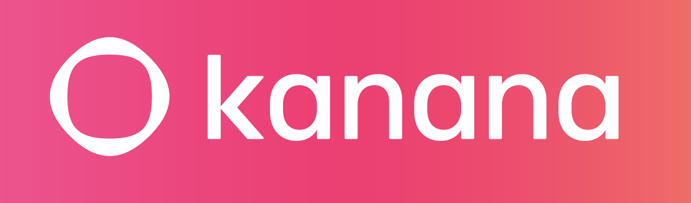

# Kanana-2

<p align="center">
    
</p>

<p align="center">
    🤗 <a href="https://huggingface.co/collections/kakaocorp/kanana-2">HF Models</a> &nbsp | &nbsp
    📕 <a href="https://tech.kakao.com/posts/807">Pre-Training Blog</a> &nbsp | &nbsp
    📕 <a href="https://tech.kakao.com/posts/808">Post-Training Blog</a> &nbsp | &nbsp
    📕 <a href="https://tech.kakao.com/posts/804">Teaser Blog</a> &nbsp
</p>
<br><br>

## News 🔥

- `2026/01/15`: 🤗 Released `kanana-2-30b-a3b-2601` HF model weights.
- `2026/01/15`: 📕 Published blog posts ([pre-training](https://tech.kakao.com/posts/807), [post-training](https://tech.kakao.com/posts/808)) about the development of `Kanana-2` models.
- `2025/12/19`: 🤗 Released `kanana-2-30b-a3b` HF model weights and publised a [teaser blog](https://tech.kakao.com/posts/804).

<br>

# Kanana-2 Hightlights

**Kanana-2**, the latest open-source evolution of the Kanana model family, is designed specifically for **Agentic AI**, presenting substantial enhancements in **tool calling, complex instruction following, and logical reasoning**. This new version adopts a cutting-edge architecture featuring MLA (Multi-head Latent Attention) and MoE (Mixture of Experts). These innovations allow the model to utilize significantly fewer active parameters compared to the previous 32.5B model while delivering superior performance and ensuring high throughput. Furthermore, the model **natively supports context lengths of up to 32,768 tokens**, enabling it to maintain coherence when handling extensive documents or long-context interactions.

In addition, Kanana-2 now supports 6 languages, covering **Korean, English, Japanese, Chinese, Thai, and Vietnamese**. To support this expansion, Kanana-2 utilizes a newly trained tokenizer that demonstrates superior tokenization efficiency across these languages, including an improvement of over 30% specifically for Korean. Finally, to address advanced problem-solving needs, Kanana-2 introduces **reasoning models** capable of deliberate thinking and reasoning, achieving significantly enhanced performance in downstream tasks, especially when tackling hard problems.

> [!NOTE]
> No Kakao user data was used for either pre-training or post-training.

<br>

## Model Overview

**kanana-2-30b-a3b** series has the following features:
- Total Parameters: 30B
- Activated Parameters: 3B
- Number of Layers: 48
- Number of Dense Layers: 1
- Number of Experts: 128
- Number of Selected Experts: 6
- Number of Shared Experts: 2
- Attention Mechanism: MLA
- Vocabulary Size: 128256
- Context Length: 32,768

<br>

## Model Downloads

<div align="left">

| **Model** | **Download** |
| :------------: | :------------: |
| kanana-2-30b-a3b-base-2601<sup>*</sup> | [🤗 HuggingFace](https://huggingface.co/kakaocorp/kanana-2-30b-a3b-base-2601)   |
| kanana-2-30b-a3b-mid-2601<sup>*</sup>  | [🤗 HuggingFace](https://huggingface.co/kakaocorp/kanana-2-30b-a3b-mid-2601)   |
| kanana-2-30b-a3b-instruct-2601 | [🤗 HuggingFace](https://huggingface.co/kakaocorp/kanana-2-30b-a3b-instruct-2601)   |
| kanana-2-30b-a3b-thinking-2601 | [🤗 HuggingFace](https://huggingface.co/kakaocorp/kanana-2-30b-a3b-thinking-2601)   |
| kanana-2-30b-a3b-base | [🤗 HuggingFace](https://huggingface.co/kakaocorp/kanana-2-30b-a3b-base)   |
| kanana-2-30b-a3b-instruct | [🤗 HuggingFace](https://huggingface.co/kakaocorp/kanana-2-30b-a3b-instruct)   |
| kanana-2-30b-a3b-thinking | [🤗 HuggingFace](https://huggingface.co/kakaocorp/kanana-2-30b-a3b-thinking)   |

<sub>
<sup>*</sup> We are releasing the <code><small>kanana-2-30b-a3b-base-2601</small></code> (prior to mid-training) checkpoint to contribute to the research community.<br>
&nbsp&nbspNote: <code><small>kanana-2-30b-a3b-mid-2601</small></code> is identical to <a href="https://huggingface.co/kakaocorp/kanana-2-30b-a3b-base">kanana-2-30b-a3b-base</a>.
</sub>

</div>

<br>

## Performance

### Base model evaluation results


<table>
<thead>
<tr>
<th align="center">Benchmark</th>
<th align="center">Metric</th>
<th align="center">Shot</th>
<th align="center">kanana-2-30b-a3b-mid-2601</th>
<th align="center">kanana-2-30b-a3b-base-2601</th>
<th align="center">kanana-1.5-32.5b-base</th>
<th align="center">Qwen3-30B-A3B-Base<sup>*</sup></th>
</tr>
</thead>
<tbody>
<tr>
<td align="center" colspan="6">General Tasks</td>
</tr>
<tr>
<td align="center">MMLU</td>
<td align="center">acc</td>
<td align="center">5</td>
<td align="center">75.44</td>
<td align="center">74.83</td>
<td align="center">76.76</td>
<td align="center">81.14</td>
</tr>
<tr>
<td align="center">MMLU-Pro</td>
<td align="center">acc</td>
<td align="center">5</td>
<td align="center">56.14</td>
<td align="center">52.61</td>
<td align="center">52.40</td>
<td align="center">61.83</td>
</tr>
<tr>
<td align="center">BBH</td>
<td align="center">acc</td>
<td align="center">3</td>
<td align="center">79.76</td>
<td align="center">76.46</td>
<td align="center">81.54</td>
<td align="center">79.97</td>
</tr>
<tr>
<td align="center">SimpleQA<sup>†</sup></td>
<td align="center">acc</td>
<td align="center">5</td>
<td align="center">29.70</td>
<td align="center">29.13</td>
<td align="center">26.95</td>
<td align="center">26.47</td>
</tr>
<tr>
<td align="center" colspan="6">Mathematics Tasks</td>
</tr>
<tr>
<td align="center">MATH</td>
<td align="center">em</td>
<td align="center">4</td>
<td align="center">54.40</td>
<td align="center">48.86</td>
<td align="center">47.68</td>
<td align="center">62.58</td>
</tr>
<tr>
<td align="center">GSM8K</td>
<td align="center">em</td>
<td align="center">8</td>
<td align="center">82.71</td>
<td align="center">76.57</td>
<td align="center">85.14</td>
<td align="center">88.10</td>
</tr>
<tr>
<td align="center" colspan="6">Coding Tasks</td>
</tr>
<tr>
<td align="center">HumanEval</td>
<td align="center">pass@1</td>
<td align="center">0</td>
<td align="center">75.29</td>
<td align="center">71.34</td>
<td align="center">75.59</td>
<td align="center">53.32</td>
</tr>
<tr>
<td align="center">MBPP</td>
<td align="center">pass@1</td>
<td align="center">3</td>
<td align="center">62.39</td>
<td align="center">60.21</td>
<td align="center">65.96</td>
<td align="center">72.58</td>
</tr>
<tr>
<td align="center" colspan="6">Korean Tasks</td>
</tr>
<tr>
<td align="center">KMMLU</td>
<td align="center">acc</td>
<td align="center">5</td>
<td align="center">62.15</td>
<td align="center">61.98</td>
<td align="center">61.56</td>
<td align="center">62.25</td>
</tr>
<tr>
<td align="center">KoSimpleQA<sup>†</sup></td>
<td align="center">acc</td>
<td align="center">5</td>
<td align="center">49.70</td>
<td align="center">49.40</td>
<td align="center">45.70</td>
<td align="center">26.33</td>
</tr>
<tr>
<td align="center">HAE-RAE Bench (v1.0)</td>
<td align="center">acc</td>
<td align="center">5</td>
<td align="center">88.73</td>
<td align="center">88.91</td>
<td align="center">90.65</td>
<td align="center">72.04</td>
</tr>
<tr>
<td align="center">MATH-Ko<sup>‡</sup></td>
<td align="center">em</td>
<td align="center">4</td>
<td align="center">54.07</td>
<td align="center">45.58</td>
<td align="center">47.42</td>
<td align="center">58.20</td>
</tr>
<tr>
<td align="center">GSM8K-Ko<sup>‡</sup></td>
<td align="center">em</td>
<td align="center">8</td>
<td align="center">77.48</td>
<td align="center">70.43</td>
<td align="center">81.43</td>
<td align="center">88.10</td>
</tr>
<tr>
<td align="center">MBPP-Ko<sup>§</sup></td>
<td align="center">pass@1</td>
<td align="center">3</td>
<td align="center">61.55</td>
<td align="center">57.29</td>
<td align="center">65.41</td>
<td align="center">66.84</td>
</tr>
<tr>
<td align="center" colspan="6">Long Context Tasks</td>
</tr>
<tr>
<td align="center">RULER-4K</td>
<td align="center">acc</td>
<td align="center">0</td>
<td align="center">93.09</td>
<td align="center">92.49</td>
<td align="center">86.39</td>
<td align="center">94.32</td>
</tr>
<tr>
<td align="center">RULER-8K</td>
<td align="center">acc</td>
<td align="center">0</td>
<td align="center">92.29</td>
<td align="center">92.14</td>
<td align="center">90.16</td>
<td align="center">92.16</td>
</tr>
<tr>
<td align="center">RULER-16K</td>
<td align="center">acc</td>
<td align="center">0</td>
<td align="center">90.73</td>
<td align="center">90.01</td>
<td align="center">85.88</td>
<td align="center">91.28</td>
</tr>
<tr>
<td align="center">RULER-32K</td>
<td align="center">acc</td>
<td align="center">0</td>
<td align="center">88.63</td>
<td align="center">87.92</td>
<td align="center">81.62</td>
<td align="center">88.32</td>
</tr>
</tbody>
</table>

<sub>
<sup>*</sup> Evaluated using an internal evaluation toolkit.<br>
<sup>†</sup> Evaluated in Multiple Choice Question Answering (MCQA) format with 10 options.<br>
<sup>‡</sup> Subsets from <a href="https://huggingface.co/datasets/HAERAE-HUB/HRM8K">HRM8K</a> (MATH, GSM8K).<br>
<sup>§</sup> Internally translated to Korean.
</sub>

<br>

### Instruct model evaluation results

<table>
<thead>
<tr>
<th align="center">Benchmark</th>
<th align="center">Metric</th>
<th align="center">kanana-2-30b-a3b-instruct-2601</th>
<th align="center">kanana-2-30b-a3b-instruct</th>
<th align="center">kanana-1.5-32.5b-instruct</th>
<th align="center">Qwen3-30B-A3B-Instruct-2507<sup>*</sup></th>
<th align="center">Qwen3-30B-A3B<br>(non-thinking)<sup>*</sup></th>
</tr>
</thead>
<tbody>
<tr>
<td align="center" colspan="6">Chat</td>
</tr>
<tr>
<td align="center">MT-Bench</td>
<td align="center">judge<sup>†</sup></td>
<td align="center">8.30</td>
<td align="center">8.42</td>
<td align="center">8.23</td>
<td align="center">8.71</td>
<td align="center">8.38</td>
</tr>
<tr>
<td align="center">KoMT-Bench</td>
<td align="center">judge<sup>†</sup></td>
<td align="center">8.21</td>
<td align="center">8.24</td>
<td align="center">7.94</td>
<td align="center">8.49</td>
<td align="center">7.89</td>
</tr>
<tr>
<td align="center" colspan="6">Instruction Following</td>
</tr>
<tr>
<td align="center">IFEval</td>
<td align="center">prompt strict</td>
<td align="center">87.25</td>
<td align="center">84.47</td>
<td align="center">79.48</td>
<td align="center">82.62</td>
<td align="center">84.10</td>
</tr>
<tr>
<td align="center">IFBench</td>
<td align="center">prompt strict</td>
<td align="center">48.30</td>
<td align="center">41.84</td>
<td align="center">38.78</td>
<td align="center">30.27</td>
<td align="center">29.25</td>
</tr>
<tr>
<td align="center">Multi-IF (EN)</td>
<td align="center">acc</td>
<td align="center">77.88</td>
<td align="center">75.81</td>
<td align="center">68.51</td>
<td align="center">77.93</td>
<td align="center">81.03</td>
</tr>
<tr>
<td align="center">Multi-Challenge</td>
<td align="center">acc</td>
<td align="center">35.16</td>
<td align="center">34.80</td>
<td align="center">19.05</td>
<td align="center">41.76</td>
<td align="center">27.84</td>
</tr>
<tr>
<td align="center" colspan="6">Tool Calling</td>
</tr>
<tr>
<td align="center">BFCL-v3<br>(Live<sup>‡</sup>)</td>
<td align="center">pass@1</td>
<td align="center">76.66</td>
<td align="center">74.30</td>
<td align="center">68.74</td>
<td align="center">73.93</td>
<td align="center">69.14</td>
</tr>
<tr>
<td align="center">BFCL-v3<br>(Multi-Turn<sup>‡</sup>)</td>
<td align="center">pass@1</td>
<td align="center">38.63</td>
<td align="center">35.38</td>
<td align="center">11.38</td>
<td align="center">38.77</td>
<td align="center">11.88</td>
</tr>
<tr>
<td align="center" colspan="6">Code Generation</td>
</tr>
<tr>
<td align="center">HumanEval+</td>
<td align="center">pass@1</td>
<td align="center">81.10</td>
<td align="center">79.88</td>
<td align="center">79.88</td>
<td align="center">86.59</td>
<td align="center">87.20</td>
</tr>
<tr>
<td align="center">MBPP+</td>
<td align="center">pass@1</td>
<td align="center">73.02</td>
<td align="center">73.81</td>
<td align="center">71.96</td>
<td align="center">75.13</td>
<td align="center">75.13</td>
</tr>
<tr>
<td align="center" colspan="6">Mathematics</td>
</tr>
<tr>
<td align="center">GSM8K</td>
<td align="center">em</td>
<td align="center">93.10</td>
<td align="center">91.89</td>
<td align="center">91.58</td>
<td align="center">93.56</td>
<td align="center">93.33</td>
</tr>
<tr>
<td align="center">MATH</td>
<td align="center">acc</td>
<td align="center">88.56</td>
<td align="center">86.26</td>
<td align="center">77.92</td>
<td align="center">90.96</td>
<td align="center">87.20</td>
</tr>
<tr>
<td align="center" colspan="6">Reasoning & Knowledge</td>
</tr>
<tr>
<td align="center">MMLU</td>
<td align="center">em</td>
<td align="center">81.61</td>
<td align="center">80.80</td>
<td align="center">82.75</td>
<td align="center">87.13</td>
<td align="center">85.60</td>
</tr>
<tr>
<td align="center">KMMLU</td>
<td align="center">em</td>
<td align="center">68.26</td>
<td align="center">67.32</td>
<td align="center">65.75</td>
<td align="center">67.56</td>
<td align="center">63.49</td>
</tr>
<tr>
<td align="center">GPQA Diamond</td>
<td align="center">pass@1</td>
<td align="center">52.53</td>
<td align="center">42.93</td>
<td align="center">42.42</td>
<td align="center">54.55</td>
<td align="center">50.51</td>
</tr>
<tr>
<td align="center">HAERAE-Bench (v1.0)</td>
<td align="center">em</td>
<td align="center">75.57</td>
<td align="center">75.57</td>
<td align="center">65.34</td>
<td align="center">53.41</td>
<td align="center">57.39</td>
</tr>
</tbody>
</table>

<sub>
<sup>*</sup> Evaluated using an internal evaluation toolkit.<br>
<sup>†</sup> Evaluated using <code><small>gpt-4o-2024-08-06</small></code> as the judge model.<br>
<sup>‡</sup> <code><small>Live</small></code> denotes the average score of 6 live benchmarks, and <code><small>Multi-Turn</small></code> denotes the average score of 4 multi-turn benchmarks.
</sub>

<br>

### Reasoning model evaluation results

<table>
<thead>
<tr>
<th align="center">Benchmark</th>
<th align="center">Metric</th>
<th align="center">kanana-2-30b-a3b-thinking-2601</th>
<th align="center">kanana-2-30b-a3b-thinking</th>
<th align="center">Qwen3-30B-A3B-Thinking-2507<sup>*</sup></th>
<th align="center">Qwen3-30B-A3B<br>(thinking)<sup>*</sup></th>
</tr>
</thead>
<tbody>
<tr>
<td align="center" colspan="6">Reasoning & Knowledge</td>
</tr>
<tr>
<td align="center">MMLU-Pro</td>
<td align="center">pass@1</td>
<td align="center">74.2</td>
<td align="center">75.3</td>
<td align="center">80.8</td>
<td align="center">78.5</td>
</tr>
<tr>
<td align="center">GPQA Diamond</td>
<td align="center">pass@1</td>
<td align="center">57.8</td>
<td align="center">61.3</td>
<td align="center">70.6</td>
<td align="center">62.6</td>
</tr>
<tr>
<td align="center" colspan="6">Competition Math</td>
</tr>
<tr>
<td align="center">AIME 2025</td>
<td align="center">pass@1</td>
<td align="center">74.0</td>
<td align="center">72.7</td>
<td align="center">82.3</td>
<td align="center">70.7</td>
</tr>
<tr>
<td align="center">AIME 2024</td>
<td align="center">pass@1</td>
<td align="center">79.0</td>
<td align="center">78.3</td>
<td align="center">91.0</td>
<td align="center">82.7</td>
</tr>
<tr>
<td align="center">AIME 2024-Ko<sup>†</sup></td>
<td align="center">pass@1</td>
<td align="center">75.0</td>
<td align="center">25.3</td>
<td align="center">80.3</td>
<td align="center">72.3</td>
</tr>
<tr>
<td align="center" colspan="6">Code Generation</td>
</tr>
<tr>
<td align="center">LiveCodeBench</td>
<td align="center">pass@1</td>
<td align="center">58.8</td>
<td align="center">60.8</td>
<td align="center">68.3</td>
<td align="center">62.3</td>
</tr>
<tr>
<td align="center">LiveCodeBench-Ko<sup>‡</sup></td>
<td align="center">pass@1</td>
<td align="center">51.2</td>
<td align="center">9.4</td>
<td align="center">66.3<sup>¶</sup></td>
<td align="center">61.5<sup>¶</sup></td>
</tr>
<tr>
<td align="center" colspan="6">Instruction Following</td>
</tr>
<tr>
<td align="center">IFEval</td>
<td align="center">prompt strict</td>
<td align="center">82.2</td>
<td align="center">82.2</td>
<td align="center">87.8</td>
<td align="center">86.1</td>
</tr>
<tr>
<td align="center">IFBench</td>
<td align="center">prompt strict</td>
<td align="center">47.8</td>
<td align="center">42.3</td>
<td align="center">47.6</td>
<td align="center">36.7</td>
</tr>
<tr>
<td align="center" colspan="6">Tool Calling</td>
</tr>
<tr>
<td align="center">BFCL-v3<br>(Live<sup>§</sup>)</td>
<td align="center">pass@1</td>
<td align="center">75.9</td>
<td align="center">75.6</td>
<td align="center">82.9</td>
<td align="center">80.3</td>
</tr>
<tr>
<td align="center">BFCL-v3<br>(Multi-Turn<sup>§</sup>)</td>
<td align="center">pass@1</td>
<td align="center">43.7</td>
<td align="center">34.3</td>
<td align="center">53.6</td>
<td align="center">35.6</td>
</tr>
</tbody>
</table>

<sub>
<sup>*</sup> Evaluated using an internal evaluation toolkit.<br>
<sup>†</sup> Korean translation of AIME 2024 sourced from <a href="https://huggingface.co/datasets/amphora/MCLM">MCLM</a>.<br>
<sup>‡</sup> Internally translated to Korean.<br>
<sup>§</sup> <code><small>Live</small></code> denotes the average score of 6 live benchmarks, and <code><small>Multi-Turn</small></code> denotes the average score of 4 multi-turn benchmarks.<br>
<sup>¶</sup> Most responses were generated in English.
</sub>

<br>

## Deployment

> [!NOTE]
> For optimal results with the reasoning model, please adhere to the default parameters: `temperature=0.6`, `top_p=0.95`, `top_k=20`. **We strongly advise against greedy decoding**, as it may lead to performance degradation and infinite repetition loops.

### vLLM
[vLLM](https://github.com/vllm-project/vllm) is a fast and memory-optimized engine designed for high-performance LLM inference and serving.

For kanana-2-30b-a3b-instruct-2601,
```shell
vllm serve kakaocorp/kanana-2-30b-a3b-instruct-2601 --enable-auto-tool-choice --tool-call-parser hermes
```

For kanana-2-30b-a3b-thinking-2601,
```shell
vllm serve kakaocorp/kanana-2-30b-a3b-thinking-2601 --reasoning-parser deepseek_r1 --enable-auto-tool-choice --tool-call-parser hermes
```

### SGLang
[SGLang](https://github.com/sgl-project/sglang) is a high-efficiency framework for serving LLMs and VLMs, enabling easy deployment of OpenAI-compatible API servers.

For kanana-2-30b-a3b-instruct-2601,
```shell
python3 -m sglang.launch_server --model-path kakaocorp/kanana-2-30b-a3b-instruct-2601 --tool-call-parser qwen
```

For kanana-2-30b-a3b-thinking-2601,
```shell
python3 -m sglang.launch_server --model-path kakaocorp/kanana-2-30b-a3b-thinking-2601 --reasoning-parser deepseek-r1 --tool-call-parser qwen
```

<br>

## Processing 32K+ Length
Currently, the `config.json` uploaded to HuggingFace is configured for token lengths of 32,768 or less. To process tokens beyond this length, YaRN must be applied. By updating the `config.json` with the following parameters, you can apply YaRN to handle token sequences up to 128K in length:
```json
"rope_scaling": {
    "beta_fast": 32,
    "beta_slow": 1,
    "factor": 4.0,
    "mscale": 1.0,
    "mscale_all_dim": 1.0,
    "original_max_position_embeddings": 32768,
    "type": "yarn",
},
```

Passing command line arguments for deployment:

- `vllm`
    ```shell
    vllm serve ... --rope-scaling '{"rope_type":"deepseek_yarn","factor":4.0,"beta_fast":32,"beta_slow":1,"mscale":1.0,"mscale_all_dim":1.0,"original_max_position_embeddings":32768}' --max-model-len 131072
    ```

- `sglang`
    ```shell
    python3 -m sglang.launch_server ... --json-model-override-args '{"max_position_embeddings":131072, "rope_scaling":{"rope_type":"deepseek_yarn","factor":4.0,"beta_fast":32,"beta_slow":1,"mscale":1.0,"mscale_all_dim":1.0,"original_max_position_embeddings":32768}}'
    ```

> [!NOTE]
> Most leading open-source implementations of static YaRN apply a constant scaling factor, which can negatively impact performance on shorter texts. To ensure optimal performance:
> * **Enable `rope_scaling` only when necessary** for processing long contexts.
> * **Adjust the `factor` based on your specific needs** (e.g., set `factor` to 2.0 for a 65,536-token context)."

<br>

## License

The model weights are released under the [Kanana License](./LICENSE).

<br>

## Citation

```
@article{,
  title={Kanana-2 LLM},
  author={Kanana LLM},
  year={2025},
  url={https://huggingface.co/collections/kakaocorp/kanana-2}
}
```

<br>

## Contact
- Kanana LLM Team Technical Support: kanana-llm@kakaocorp.com
- Business & Partnership Contact: alpha.k@kakaocorp.com
